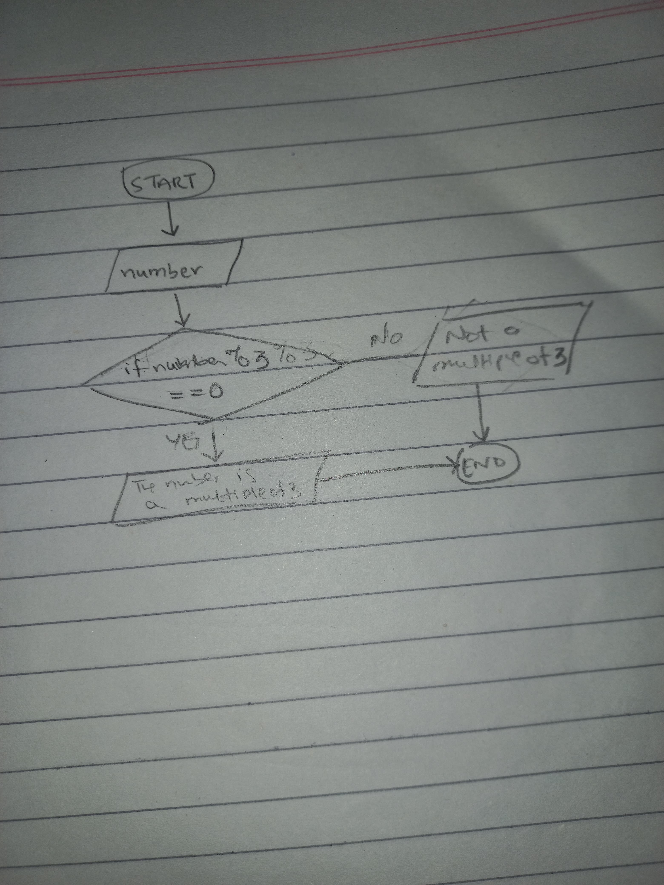

<!--
* Name: ASAD IMRAN
* Date: 9 sept 24
* Desc: Question01 pseudocode, and flowchart
-->

- Pseudocode
      speed = 0 
      WHILE speed <= 0 DO
        OUTPUT "Enter the speed in kilometers per seconds" 
        INPUT speed
      ENDWHILE 
      speed = (speed * 3600 ) / 1.60934
      OUTPUT speed
  
- Flowchart

