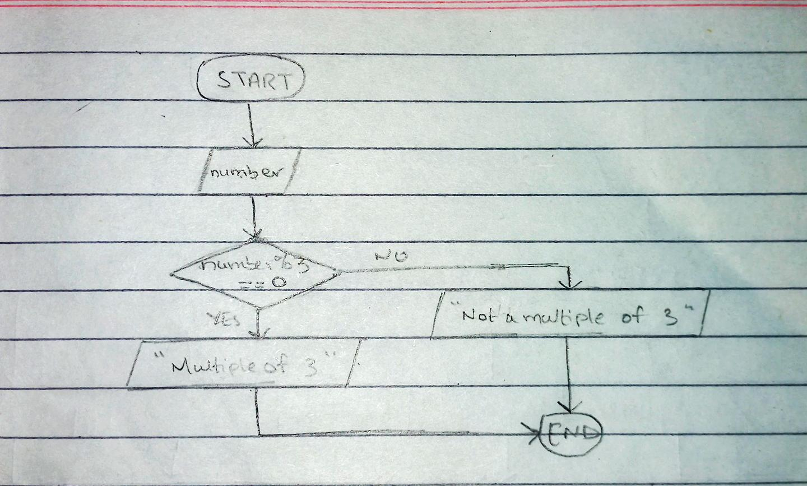

<!--
* Name: ASAD IMRAN
* Date: 9 sept 24
* Desc: Question01 pseudocode, and flowchart
-->

- Pseudocode
 
      INPUT number
      if number % 3 == 0:
      print("The number is a multiple of 3")
      else:
      print("The number is not a multiple of 3")
  
- Flowchart

