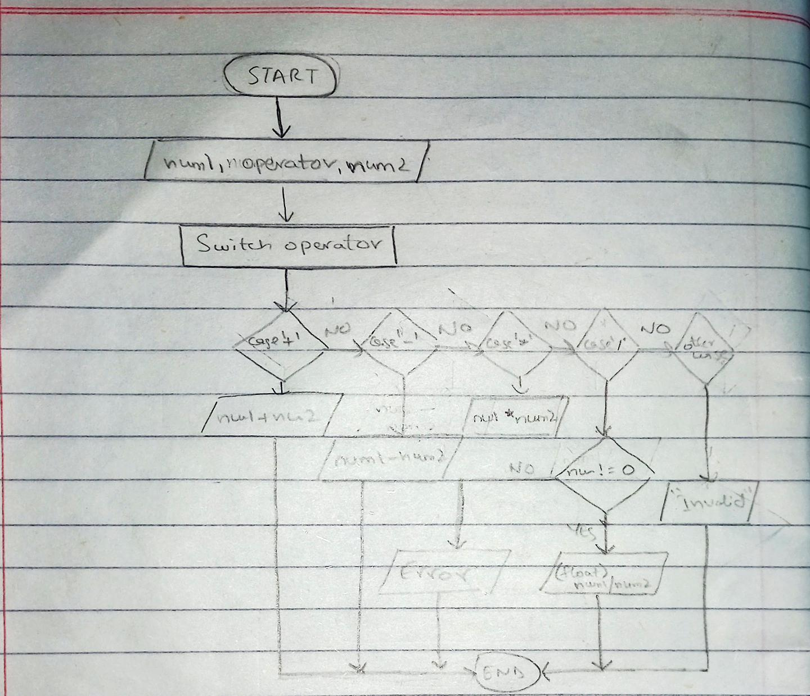

<!--
* Name: ASAD IMRAN
* Date: 9 sept 24
* Desc: Question01 pseudocode, and flowchart
-->

- Pseudocode

      START
      PRINT "Enter number 1: "
      INPUT num1
      PRINT "Enter operator (+, -, *, /): "
      INPUT operator
      PRINT "Enter number 2: "
      INPUT num2
     
      SWITCH operator4
        case +
            PRINT "The sum is ", num1 + num2
            BREAK
        case -
            PRINT "The sum is ", num1 - num2
            BREAK
        case *
            PRINT "The sum is ", num1 * num2
            BREAK
        case /
            IF num2 != 0 THEN
                PRINT "The division is " num1 / num2
            ELSE
                PRINT "Error: Division by zero is not allowed."
            ENDIF
            BREAK
        DEFAULT
            PRINT "Invalid operator!"
            BREAK
      ENDSWITCH
          
  
- Flowchart

