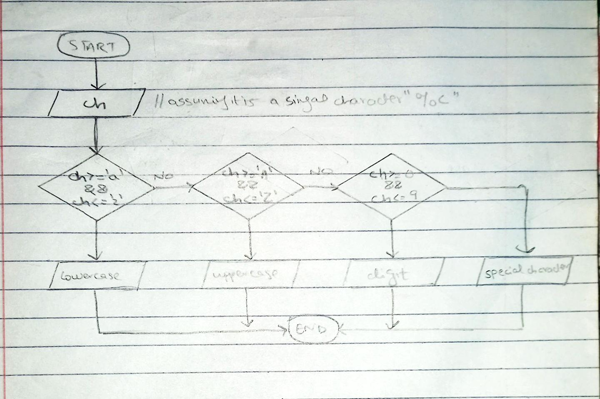

<!--
* Name: ASAD IMRAN
* Date: 9 sept 24
* Desc: Question01 pseudocode, and flowchart
-->

- Pseudocode

        START
        PRINT "Add a character to check: "
        INPUT ch
        
        IF ch >= a AND ch <= z
            PRINT ch," is s alowercase alphabet"
        ELSE IF ch is >= 'A' AND ch <= 'Z' THEN
            PRINT ch," is an uppercase alphabet"
        ELSE IF ch >= '0' AND ch <= '9' THEN
            PRINT ch," is a digit"
        ELSE
            PRINT ch," is a special character"
        ENDIF
        
        END

    

- Flowchart

