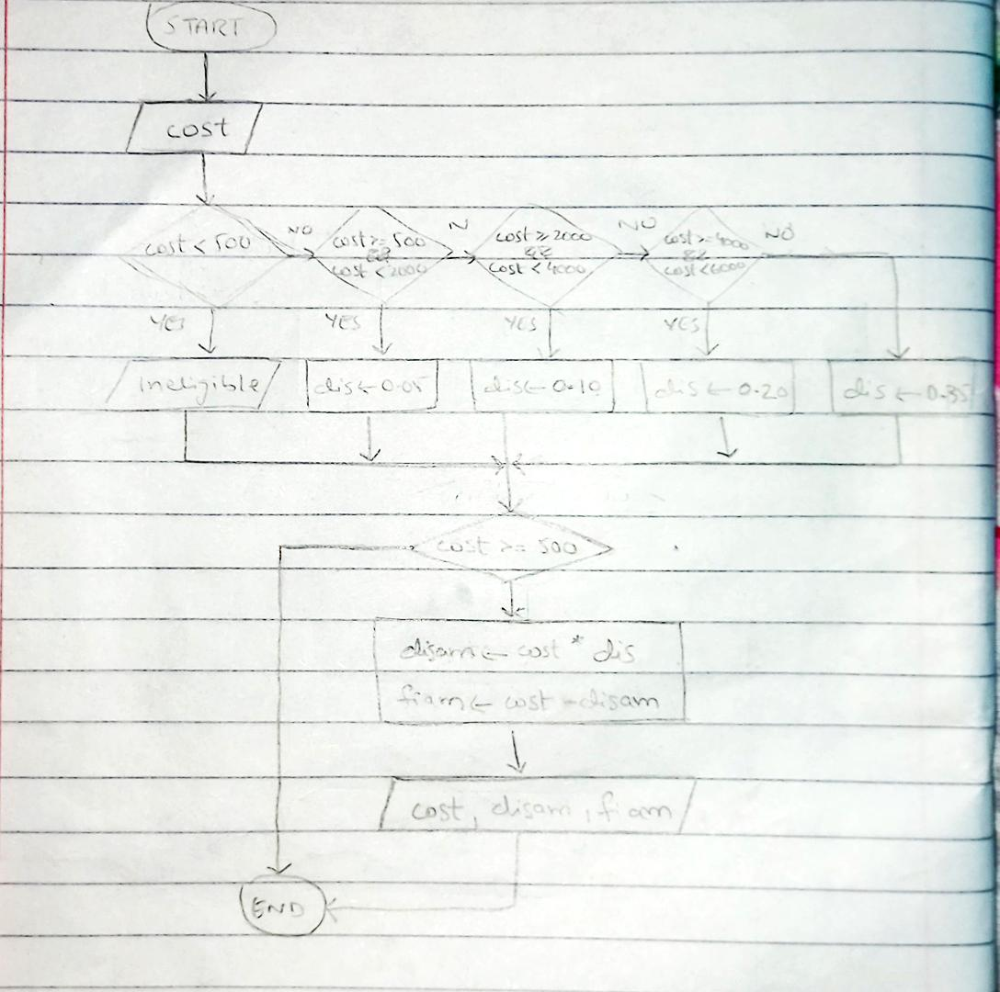

<!--
* Name: ASAD IMRAN
* Date: 9 sept 24
* Desc: Question01 pseudocode, and flowchart
-->

- Pseudocode
 
        START
            PRINT "Enter the cost of item: "
            INPUT cost
        
            IF cost < 500 THEN
                PRINT "Ineligible for the discount!"
            ELSE IF cost >= 500 AND cost < 2000 THEN
                discountPercent = 0.05
            ELSE IF cost >= 2000 AND cost < 4000 THEN
                discountPercent = 0.10
            ELSE IF cost >= 4000 AND cost < 6000 THEN
                discountPercent = 0.20
            ELSE
                discountPercent = 0.35
            END IF
        
            IF cost >= 500 THEN
                discountAmount = cost * discountPercent
                amountAfterDiscount = cost - discountAmount
        
                PRINT "The Cost before discount: ", cost
                PRINT "The saved amount: ", discountAmount
                PRINT "The amount after discount: ", amountAfterDiscount
            END IF
        END

- Flowchart

