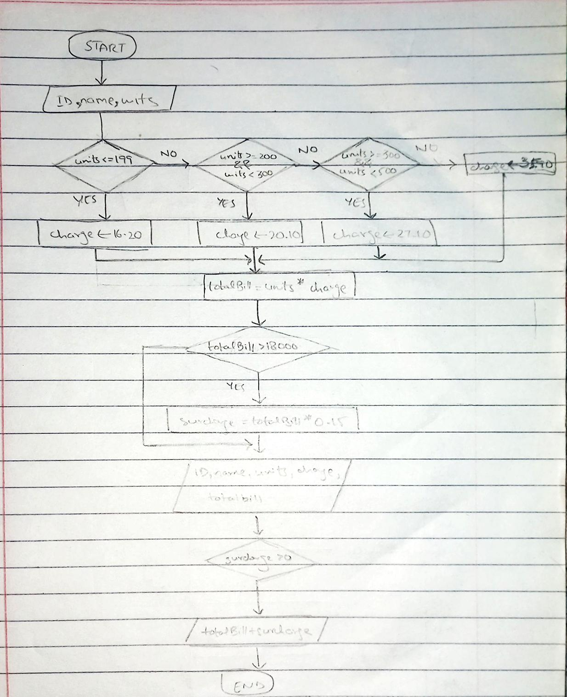

<!--
* Name: ASAD IMRAN
* Date: 9 sept 24
* Desc: Question01 pseudocode, and flowchart
-->

- Pseudocode
 
        Start
        PRINT "Enter Customer ID:"
        INPUT customerID
        PRINT "Enter Customer Name:"
        INPUT customerName
        PRINT "Enter Units Consumed:"
        INPUT unitsConsumed
        
        IF unitsConsumed <= 199
            chargePerUnit = 16.20
        ELSE IF unitsConsumed >= 200 AND unitsConsumed < 300
            chargePerUnit = 20.10
        ELSE IF unitsConsumed >= 300 AND unitsConsumed < 500
            chargePerUnit = 27.10
        ELSE
            chargePerUnit = 35.90
        
        totalBill = unitsConsumed * chargePerUnit
        
        IF totalBill > 18000
            surcharge = totalBill * 0.15
        ELSE
            surcharge = 0
        
        PRINT "Electricity Bill"
        PRINT "Customer ID:" customerID
        PRINT "Customer Name:" customerName
        PRINT "Units Consumed:" unitsConsumed
        PRINT "Amount Charged @ Rs." chargePerUnit "per unit:" totalBill
        
        IF surcharge > 0
            PRINT "Surcharge Amount:" surcharge
        
        PRINT "Net Amount Paid by the Customer:" (totalBill + surcharge)
        End

  
- Flowchart
  

