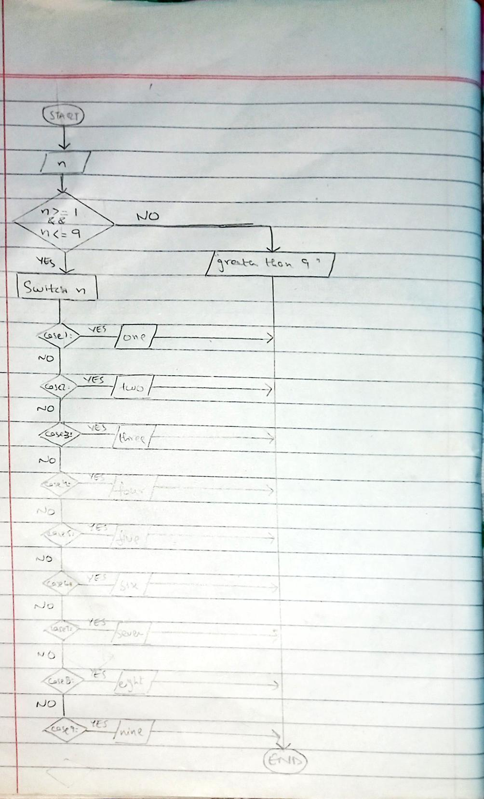

<!--
* Name: ASAD IMRAN
* Date: 9 sept 24
* Desc: Question01 pseudocode, and flowchart
-->

- Pseudocode
 
        START
        PRINT "Enter a positive integer: "
        INPUT n
        
        IF n >= 1 AND n <= 9 THEN
            SWITCH n
                CASE 1: PRINT "one"
                CASE 2: PRINT "two"
                CASE 3: PRINT "three"
                CASE 4: PRINT "four"
                CASE 5: PRINT "five"
                CASE 6: PRINT "six"
                CASE 7: PRINT "seven"
                CASE 8: PRINT "eight"
                CASE 9: PRINT "nine"
            END SWITCH
        ELSE
            PRINT "greater than 9"
        END IF
        END

  
- Flowchart

